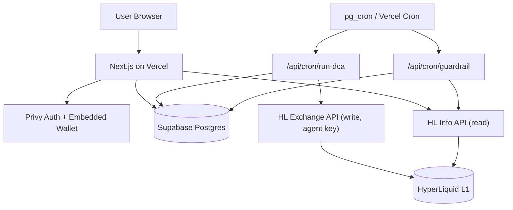
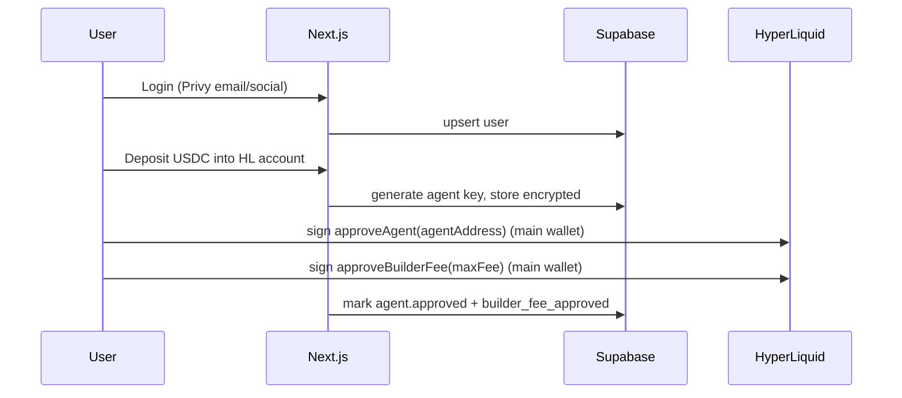
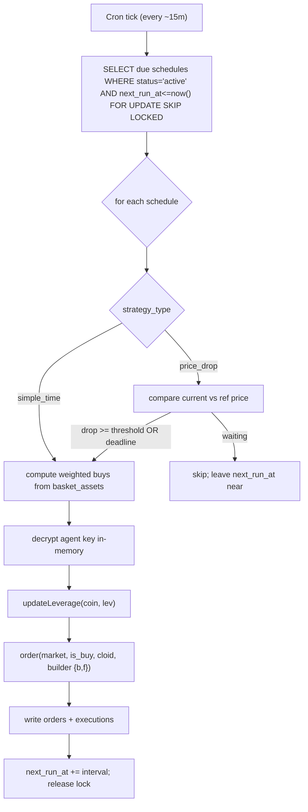

# HyperDCA — Technical Product Documentation (MVP)


Use context7

Greenfield. **Reference prototype (LIVE, running in production): `/Users/abhinav.singh-ext/Documents/codes/hyperliquid-dca`** — a single-user Python DCA bot trading real money on HL mainnet via GitHub Actions. It is the source of truth for HL integration mechanics. We port its trading *logic* verbatim (see Section 12) and discard only its single-user architecture (JSON-in-repo state, per-repo cron, single wallet). Key files: `bot/dca_bot.py`, `bot/dip_buy.py`, `bot/config.json`, `dashboard/index.html`, `.github/workflows/*.yml`.

## 0. Environment & access status (checked Jun 20)

Local tooling (verified via CLI):

- Runtimes: Node v24.13.1, npm 11.8, pnpm 10.32, Bun 1.3.12 (no yarn; not needed).
- git 2.50.1, identity `abhinxx <absingh3010@gmail.com>`.
- GitHub CLI `gh`: authenticated as `abhinxx`, scopes `repo, workflow, gist, read:org` — sufficient to create the repo, push, and manage Actions.
- Supabase CLI 2.78.1: authenticated (org `osqtkqvgwsjdhdkcbbef`). Existing projects: `ledger-tech-assessment`, `arway`. No HyperDCA project yet; workspace not linked. (CLI behind latest v2.107 — optional upgrade.)
- Docker 29.2.1 — enables `supabase start` for local DB dev.
- Vercel CLI via `npx vercel` (v54.14.2) — authenticated as `abhinxx` (team `abhinxxs-projects`).
- Workspace `HyperDCA/` is empty and not yet a git repo.
- MCP servers available as an alternative to CLIs: Supabase MCP, Vercel MCP.

Gaps to close (tooling):

- Create a dedicated Supabase project for HyperDCA (recommended over reusing `arway`/`ledger-`*).
- `git init` the workspace + create GitHub repo (`gh repo create`).

Inputs needed from you (cannot derive from CLI):

- Privy (you have this): `PRIVY_APP_ID`, `PRIVY_CLIENT_ID`, `PRIVY_APP_SECRET` -> paste into env.
- Builder wallet: a funded HL wallet address holding >= 100 USDC -> `BUILDER_ADDRESS`; choose `BUILDER_MAX_FEE` (<= 0.1% perp).
- Phase 0 test wallet: a private key with a little USDC/USDH on HL (mainnet or testnet) to validate live ordering.
- Generated by us: `HL_KEY_ENC_SECRET` (32-byte master key), `CRON_SECRET`.

## 1. Product scope (locked)

- Themed **perp** baskets (stocks/commodities/pre-IPO/crypto via HIP-3 + HyperCore). Perp-only is intentional: the TradFi instruments only exist as perps, and builder fees apply to both sides of perp trades (zero on spot buys).
- **Automated DCA** per basket: invest $X every Y. Two strategies at launch: `simple_time` and `price_drop` (reuse prototype dip logic). Momentum/RSI deferred.
- **Leverage 1x default**, 2x-5x as an explicit opt-in "risk dial" with liquidation-price + carry-cost preview.
- **Exit model**: accumulate + one-click "close basket" + **mandatory liquidation guardrail**. Take-profit/stop-loss opt-in, off by default. No automated profit-taking by default.
- **Monetization**: HyperLiquid builder codes (max 0.1% perp). Builder wallet must hold >= 100 USDC.
- UI is a thin layer built after the logic layer (this doc front-loads the headless engine).

## 2. Tech stack (minimal, all TypeScript)

- Frontend + API + cron routes: **Next.js (App Router, TS) on Vercel** — one deployable.
- DB: **Supabase Postgres** (+ Supabase Vault optional for the master key). RLS as defense-in-depth.
- Auth + wallet: **Privy** (email/social login + embedded wallet) — critical for the non-crypto audience.
- HyperLiquid: `**@nktkas/hyperliquid`** (v0.32+, actively maintained) + **viem** for signing.
- Scheduler: **Supabase `pg_cron` + `pg_net`** hitting an authenticated Vercel route (free, 1-min granularity) — recommended over Vercel Cron (sub-daily ticks require Vercel Pro). Either works; both call the same endpoint.
- CI/CD: **GitHub -> Vercel** auto-deploy. Supabase migrations as SQL files via Supabase CLI.

## 3. Architecture




Principle: **HL = source of truth for STATE** (positions, fills, funding, PnL), read via Info API. **DB = source of truth for INTENT** (users, agent keys, baskets, schedules) + thin execution log for idempotency/attribution.

## 4. Data model (7 tables)

```sql
users            (id, privy_id unique, email, main_wallet, builder_fee_approved bool, created_at)
agent_keys       (id, user_id fk, agent_address, encrypted_private_key bytea, approved bool, created_at)
baskets          (id, owner_user_id null, name, theme, description, is_public bool, created_at)
basket_assets    (id, basket_id fk, coin, dex, weight numeric, sz_decimals, collateral, is_cross bool)
schedules        (id, user_id fk, basket_id fk, amount_usd, interval_seconds, leverage int default 1,
                  strategy_type, params jsonb, take_profit_pct null, stop_loss_pct null,
                  status, next_run_at, locked_until null, created_at)
executions       (id, schedule_id fk, user_id fk, ran_at, cycle_start, status, detail jsonb)
orders           (id, execution_id fk, schedule_id fk, coin, dex, cloid text unique,
                  requested_usd, status, fill_px, fill_sz, notional, error, created_at)
```

- `baskets.owner_user_id = null` -> curated global template; otherwise user-created. A user "subscribing" creates a `schedules` row pointing at the shared basket (no basket duplication).
- `orders.cloid` (unique) = idempotency + fill attribution (maps an HL fill back to schedule/basket/trigger).
- Positions/PnL/funding are NOT stored as truth — read live from HL, cache later if needed.

Sensitivity tiers:

- **Secret**: `agent_keys.encrypted_private_key` -> envelope-encrypted (AES-256-GCM), master key in Vercel env (`HL_KEY_ENC_SECRET`), decrypted only in cron runtime, never logged/returned.
- **Confidential (financial PII)**: `schedules`, `orders`, `executions` -> RLS + every query scoped by `user_id`; not a credential, no per-field encryption. Main risk is an authz bug, not theft.
- **Public**: wallet address, curated basket templates.

## 5. Onboarding + approval flow




- Agent (API) wallet **cannot withdraw** -> custody blast radius is "bad trades," not stolen funds.
- One-time signing. After this, the backend trades on the user's behalf.
- **Funding model (decided)**: user tops up USDC on **Arbitrum** into their Privy embedded wallet, then deposits that USDC into HyperLiquid (HL Arbitrum bridge -> HL perps account). MVP surfaces clear top-up + deposit steps; the executor treats "funds on HL" as a precondition and skips/logs "awaiting funds" until balance is present.

## 6. Scheduler + executor (one data-driven cron)




- **Exactly two cron jobs total for all users, forever**: `run-dca` (executor heartbeat) + `guardrail` (liquidation monitor). Adding users/baskets/cadences never adds cron jobs.
- **Not** one cron per user. Single tick; the `WHERE next_run_at <= now()` query picks whoever is due. Different intervals/strategies coexist as different rows.
- **Cadence lives in data, not cron**: weekly vs daily is purely `interval_seconds` + `next_run_at` per row. A weekly user's `next_run_at` is simply 7 days out, so the heartbeat ignores them until then; a daily user's is 1 day out. After firing, `next_run_at += interval_seconds`.
- Tick frequency = scheduler *resolution* (15m), not everyone's trade cadence. Heartbeat must be <= shortest supported cadence and frequent enough for `price_drop` dip detection.
- **Idempotency/locking**: `FOR UPDATE SKIP LOCKED` (or `locked_until`) + `cloid` per order; dedupe against HL fills on retry.
- **Failure isolation**: each schedule in its own try/catch; one user's error never aborts the tick.
- **Thundering herd**: jitter the minute when a daily schedule is created to spread load.
- **Catch-up**: port prototype's missed-deadline "catch up one cycle" rule onto `next_run_at`.
- HIP-3 routing: validate `userDexAbstraction`/`agentEnableDexAbstraction` to avoid manual USDC->USDH swaps; else port the prototype's `swap_usdc_to_usdh` + `perp_dexs` handling.

## 7. State read + funding (carry) UX

- Holdings/PnL: `allDexsClearinghouseState` (one call across all HIP-3 dexes).
- Fills history: `userFillsByTime`; funding paid: `userFunding`.
- **Carry cost as expense ratio**: `predictedFundings` + historical funding -> annualize per asset -> aggregate per basket weighted -> display "est. carry X%/yr at {leverage}x". Reframes funding as an ETF expense ratio. Funding scales with notional (= margin x leverage); show how the number grows with the leverage dial.

## 8. Liquidation guardrail (mandatory for lev > 1x)

- Separate light cron `/api/cron/guardrail`: read `clearinghouseState`, compute margin ratio / distance to liquidation per user.
- Threshold breach -> flag in DB + alert (email now; Telegram in Phase 3). Optional auto-reduce later.
- Prefer isolated margin for HIP-3 stock/commodity legs to prevent cross-margin cascade liquidation across a basket.

## 9. Repo structure

```
app/
  api/
    cron/run-dca/route.ts        # executor (CRON_SECRET protected)
    cron/guardrail/route.ts      # liquidation monitor
    baskets/, schedules/, onboarding/route.ts
  (ui later)
lib/
  hl/                            # SDK wrappers: approve, order, read, funding, dexAbstraction
  strategies/                    # simple_time.ts, price_drop.ts (branch on strategy_type)
  crypto/envelope.ts             # AES-256-GCM key encryption
  db/                            # supabase client + typed queries (service role, server-only)
supabase/migrations/*.sql
```

## 10. Env / secrets (Vercel)

- Client (public): `NEXT_PUBLIC_PRIVY_APP_ID`, `NEXT_PUBLIC_PRIVY_CLIENT_ID`, `NEXT_PUBLIC_SUPABASE_URL`, `NEXT_PUBLIC_SUPABASE_ANON_KEY`.
- Server (secret): `PRIVY_APP_SECRET`, `SUPABASE_SERVICE_ROLE_KEY`, `HL_KEY_ENC_SECRET` (32-byte master key), `CRON_SECRET`.
- Config: `BUILDER_ADDRESS`, `BUILDER_MAX_FEE` (<= 0.1% perp), `HL_NETWORK` (mainnet/testnet).

## 11. Key risks / decisions to validate

- **Phase 0 gate (blocking)**: confirm TS SDK can place a 1x order on `vntl:MAG7`/`xyz:*` with collateral handled (via DEX abstraction or USDH swap) + builder fee. If it can't, fall back to a thin Python execution endpoint (only for execution).
- Real funding levels on HIP-3 legs may be high/volatile (more responsive formula, 4%/hr cap) — validate the carry UX is honest before launch.
- Vercel function timeout vs fan-out at scale -> batch later; fine at MVP scale.
- Crypto-spot sleeve (if added later) earns no builder buy-fee -> needs separate monetization.

## 12. Learnings from the live prototype (port verbatim into `lib/hl` + executor)

These are battle-tested against HL mainnet. Re-implement in TS; do NOT reinvent. Cite-by-line below.

### 12.1 Order execution mechanics (`bot/dca_bot.py`)

- **Size = margin x leverage, then floor to `sz_decimals`** or the order is rejected (`dca_bot.py:81-84`):

```
  notional = margin * leverage
  size = floor((notional / price) * 10**sz_decimals) / 10**sz_decimals
  

```

- **Price comes from `allMids`, and for HIP-3 you MUST pass the `dex`** (`dca_bot.py:44-48`). A bare `allMids` will not contain `vntl:*`/`xyz:*` coins.
- **Leverage update has a cross/isolated fallback gotcha** (`dca_bot.py:86-88`): call `updateLeverage(lev, coin, is_cross)`; if it returns non-ok, retry with `is_cross = not is_cross`. HIP-3 assets often only allow one margin mode.
- **Market entry**: `market_open(coin, is_buy=True, sz, px=None, slippage)` (`dca_bot.py:90`). TS equivalent = `order` with IOC marketable limit; honor a `slippage` param.
- **Fill parsing**: response path `response.data.statuses[]` -> `filled {totalSz, avgPx}` or `error` (`dca_bot.py:92-99`). Notional = `totalSz * avgPx`.
- USDC balance via info `spotClearinghouseState` (`dca_bot.py:51-56`).

### 12.2 HIP-3 routing + USDH collateral (the hardest-won part)

- `**Exchange` must be constructed with `perp_dexs` listing `""` (main) + every HIP-3 dex used** (`dca_bot.py:287-293`). Orders to `xyz`/`vntl` fail without it. TS analog: validate whether `userDexAbstraction`/`agentEnableDexAbstraction` removes this need (Phase 0).
- **HIP-3 stock/commodity dexes (vntl, xyz) settle in USDH, not USDC.** Before trading them, swap USDC->USDH by buying spot pair `**@230`** with an **IOC limit at px 1.02**, `sz = round(max(amount+1, 11), 2)` (min 11 USDC notional, +1 buffer) (`dca_bot.py:59-72`). This swap + the `collateral`/`swap_pair` config is the thing to either replicate or replace with DEX abstraction.
- **Coin naming**: HIP-3 coins are dex-prefixed (`vntl:MAG7`, `xyz:COPPER`, `xyz:SKHX`, `xyz:SNDK`); main-dex coins are bare (`BTC`, `HYPE`, `SOL`).

### 12.3 Cycle + state logic (port into `schedules`/executor, replacing history.json)

- Rolling 24h cycle anchored at `session_started_at`; deadline at +23h; force-buy any still-pending assets in the final hour (`dca_bot.py:22-23, 130-211`). This maps onto `next_run_at` (= cycle end) + a deadline window.
- **Catch up exactly one missed cycle**, never backfill multiple (`dca_bot.py:194-211`).
- **DCA reference price = last `type=="dca"` fill only**; opportunistic dip buys must NOT reset the reference (`dca_bot.py:102-114`). Critical for the `price_drop` strategy's correctness.
- Two thresholds per asset: `intraday_drop` (~~3%) = buy early within the cycle; `dip_threshold` (~~10%) = separate opportunistic dip buy vs last entry (`config.json`, `dip_buy.py:135-159`).

### 12.4 Per-asset config -> `basket_assets` columns

`config.json` asset shape proves the columns we need: `coin, dex, sz_decimals, cross(bool), collateral(USDC|USDH), swap_pair(@230)`. Strategy params (`intraday_drop`, `dip_threshold`, slippage) move to `schedules.params`. Curated seed list lives in `config.json` (BTC, HYPE, SOL, ETH, AAVE, NEAR, MORPHO, TRX, CC, `vntl:MAG7`, `xyz:SKHX`, `xyz:COPPER`, `xyz:SNDK`).

### 12.5 Dashboard read patterns (`dashboard/index.html`)

- Live positions via `clearinghouseState` **per dex** then merged (`index.html:303-318`); allocation/PnL from `assetPositions[].position` (`szi, entryPx, positionValue, unrealizedPnl, marginUsed`).
- Confirms the read model: HL is queried live per-dex; our `allDexsClearinghouseState` call collapses this into one request.

### 12.6 What to explicitly discard

- `history.json` as state, `config.json` as the only config, GitHub Actions cron, committing state back to the repo, single `AGENT_PRIVATE_KEY`/`MAIN_WALLET_ADDRESS` env. Replaced by Postgres + multi-tenant cron + per-user encrypted agent keys.

